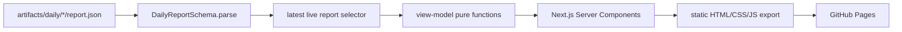

# GitHub Picks Web MVP 设计规格

日期：2026-08-04

状态：已授权直接实施

上游契约：`DailyReport v0.1.0`

## 1. 目标

建设一个无需登录的中文静态网站，让用户在 30 秒内回答四个问题：今天有哪些值得关注的开源项目、为什么值得关注、证据是否充分、采用前有什么风险。

本里程碑只消费已经生成的 `artifacts/daily/*/report.json`，不复制采集、评分或中文分析逻辑。网站构建失败时不得发布半成品，也不得把证据回放结果伪装成实时日报。

## 2. 已确认范围

### 2.1 本期交付

- 首页：最新实时日报、Top 3 编辑精选、综合榜、其他榜单摘要和五方向入口。
- 方向页：AI Coding 与 Agent、数据与机器学习、应用平台、基础设施与开发工具、安全与供应链。
- 项目详情：八维评分、置信度、风险、中文分析、事实指标、信源和证据链接。
- 信源状态页：本次运行的健康、降级和缺失说明。
- 静态导出：可部署到 GitHub Pages 或任意静态托管。
- GitHub Pages 工作流：只在 `master` 更新网站相关文件后构建发布，功能分支不会自动覆盖线上站点。

### 2.2 明确不做

- 登录、GitHub OAuth、云端收藏和跨设备同步。
- 搜索、项目对比、组织档案、历史趋势图和完整公开 API。
- 邮件或即时消息推送。
- Obsidian 插件和个性化 Agent。
- 在浏览器重新计算分数、调用 GitHub API 或读取 `artifacts/raw/`。

这些能力按既定顺序留给后续独立里程碑，避免首版成为没有稳定边界的门户工程。

## 3. 方案比较

### 方案 A：技术情报编辑部（采用）

首页像一份每日开源情报简报：用强日期、Top 3 头条、明确的“为什么 / 风险 / 下一步”和高密度榜单组织信息。它能同时突出判断和证据，符合 GitHub Picks 不只看 Star 的定位。

代价是需要精细处理中文排版和信息层级，但不需要图表库或复杂客户端状态。

### 方案 B：GitHub 原生高密度列表

视觉接近 GitHub Trending，学习成本最低，20 个项目可以快速扫完。缺点是容易退化为另一个热门仓库列表，八维评分、风险和信源差异不够突出，产品辨识度弱。

### 方案 C：分析仪表盘

以雷达图、KPI 卡片和过滤器为中心，适合长期数据运营。当前只有单日 20 个项目，没有足够历史窗口支撑复杂图表；首版采用会制造“数据很完整”的错觉，并增加客户端 JavaScript。

选择方案 A。方向页保留方案 B 的扫读效率，项目详情吸收方案 C 的维度对比，但不引入装饰性图表。

## 4. 视觉方向

### 4.1 概念

关键词是“开源情报报纸 × 工程终端”，不是常见的白底紫色渐变 SaaS 仪表盘。

- 主背景：暖纸色 `#F2EBDD`。
- 主文字：深墨色 `#141512`。
- 分隔与次要文字：石墨灰 `#65665F`、线框色 `#C9C1B2`。
- 重点动作与风险：朱红 `#E34B32`。
- 新鲜与健康信号：荧光绿 `#B8F34A`。
- 深色信息带：`#20231F`。

标题使用有中文气质的衬线字体，正文使用清晰的中文无衬线字体，仓库名、版本、分数和时间使用等宽字体。字体通过 `next/font` 在构建时本地化，不在浏览时依赖第三方字体 CDN。

### 4.2 记忆点

首页顶部不是营销 Hero，而是一条“今日情报封面”：左侧是超大北京时间日期与运行状态，中央是当日第一名，右侧是信源健康脉冲。榜单序号使用大号编辑编号，项目卡片像带批注的情报档案。

### 4.3 动效

- 首屏采用一次 400–700ms 的分层进入动画。
- 卡片 hover 只做 2px 位移、边框和批注线变化。
- 分数条使用 CSS 过渡，不使用持续闪烁或循环动画。
- `prefers-reduced-motion: reduce` 时关闭所有非必要动画。

## 5. 信息架构

### 5.1 全局导航

- GitHub Picks 标识与“独立非官方项目”短声明。
- 今日榜单。
- 五个方向入口。
- 信源状态。
- 方法说明锚点。
- GitHub 仓库外链。

移动端使用原生 `<details>` 展开导航，避免仅为菜单引入客户端状态。

### 5.2 首页 `/`

1. 今日情报封面：日期、采集模式、评分版本、发现/补全/发布数量。
2. Top 3 编辑精选：第一名占双栏，第二、三名纵向排列。
3. 信源降级提示：只有存在降级或离线源时出现，链接到信源页。
4. 综合价值榜：显示完整榜单；每行回答项目用途、发布分、置信度、风险和最强维度。
5. 榜单切片：趋势上升、新项目、隐藏宝石、开发活跃，各显示前 5。
6. 五方向索引：显示方向前 3 和独立页面入口。
7. 方法说明：八维权重、Star 上限、风险与缺失值语义。

### 5.3 方向页 `/directions/[direction]`

- 方向中文名称和判断边界。
- 当前入榜数量、最高分、中位置信度。
- 完整方向榜。
- 空榜时解释“未达到证据门槛”，不显示虚构占位项目。
- 提供回到首页和相邻方向的导航。

### 5.4 项目详情 `/repositories/[owner]/[repo]`

- 项目名、描述、语言、许可证、Star、Fork、最近推送和 GitHub 外链。
- 发布分、基础分、置信度、风险扣分四个分离指标。
- 八维评分条，不能把置信度画成第九维价值分。
- “为什么值得看 / 适合谁 / 风险 / 下一步”四段中文分析。
- 明确风险 Finding 与缺失字段；无扣分不等于安全审查通过。
- 近期活动：活跃日、真人参与者、Push、PR、Issue、Release。
- 候选发现信号和公开 Evidence URL；原始对象 SHA 不公开展示。

### 5.5 信源状态 `/sources`

- 健康、降级、离线数量概览。
- 每个执行信源的状态、采集时间和说明。
- 解释“配置候选”“GitHub 同组”“独立社区组”的区别。
- 解释 Scorecard 缺失是覆盖不足，不是安全通过或安全失败。

## 6. 技术架构

### 6.1 应用边界

在 monorepo 新增 `apps/web`：

```text
apps/web/
  src/app/                    Next.js App Router 页面
  src/components/             纯展示组件
  src/lib/report-store.ts     文件发现、Schema 校验和最新日报选择
  src/lib/view-model.ts       DailyReport 到页面模型的纯转换
  src/styles/                 设计令牌和全局样式
  test/                       数据与页面模型测试
  e2e/                        关键浏览流程
```

`@github-picks/core` 继续拥有 `DailyReportSchema`。网站不得定义第二份相似 Schema，也不得导入 worker。

### 6.2 静态生成

- Next.js App Router 配置 `output: "export"` 和 `trailingSlash: true`。
- 构建时扫描 `artifacts/daily/*/report.json`。
- 只允许 `mode: "live"` 的日报成为公开最新日报；replay 只用于测试。
- 最新日报按 `date`、再按 `generatedAt` 选择。
- 所有方向和项目路径通过 `generateStaticParams()` 构建。
- `dynamicParams = false`，未知项目返回静态 404。
- `NEXT_PUBLIC_BASE_PATH` 支持 GitHub Project Pages 的 `/github-picks`，本地和自定义域名保持空值。

Next.js 官方文档确认 `output: "export"` 会在构建时为路由生成静态 HTML，可由任意静态服务器托管：<https://nextjs.org/docs/app/guides/static-exports>。

### 6.3 数据流



页面组件只接收已经格式化的 ViewModel。数值格式、方向名称、置信度标签、风险摘要和证据筛选都在纯函数层处理，便于测试并避免多个页面口径不一致。

### 6.4 客户端 JavaScript 边界

首版页面默认使用 Server Components 和原生 HTML 交互。除 Next.js 导航所需代码外，不实现客户端数据请求、全局状态、图表库或动画库。后续本地收藏需要时再增加小型 Client Component。

## 7. 组件边界

- `SiteHeader`：品牌、主导航和移动端菜单。
- `DailyMasthead`：日期、模式、版本、计数和头名项目。
- `SourcePulse`：健康状态摘要和降级入口。
- `TopStoryCard`：Top 3 编辑卡片。
- `RepositoryRow`：高密度榜单行。
- `ScoreBadge`：发布分与风险分离展示。
- `ConfidenceLabel`：高/中/低标签与原始百分比。
- `DimensionBars`：八维水平条和权重说明。
- `AnalysisBrief`：四段中文决策分析。
- `EvidenceList`：去重后的公开证据外链。
- `SourceHealthTable`：响应式信源状态表。
- `EmptyRanking`：证据门槛导致空榜时的诚实说明。

每个组件只做展示，不读取文件、不计算评分、不访问网络。

## 8. 错误与降级

- 找不到实时日报：构建失败，并指出扫描目录；不能自动选择 replay。
- JSON 无法通过 `DailyReportSchema`：构建失败，保留上一次成功部署。
- 榜单引用不存在的仓库：构建失败，避免产生空详情链接。
- 单个方向为空：允许构建，用 `EmptyRanking` 解释证据门槛。
- 信源降级：网站正常发布，但首屏出现醒目而克制的降级横条。
- 缺失许可证：显示风险扣分和“生产采用前需核验”。
- Scorecard 缺失：显示“安全工程证据缺口”，不显示红色漏洞结论。
- 外部 GitHub 或证据链接不可用：不影响静态页面加载，链接使用 `rel="noreferrer"`。

## 9. 可访问性与响应式

- 语义化 `header/nav/main/section/article/table`。
- 全站键盘可达，焦点环不被移除。
- 文字与背景达到 WCAG AA 对比度。
- 状态不只依赖颜色，必须同时有文字和符号。
- 375px、768px、1280px 三档验收，无水平滚动。
- 表格在窄屏转换为定义列表式卡片，不强迫横向拖动。
- 外链提供可理解名称，不使用孤立的“点击这里”。

## 10. SEO 与性能

- 每页静态 metadata、Open Graph 标题和中文描述。
- 项目页 canonical 路径使用小写稳定 ID。
- 不使用远程头像、背景视频和大型图表库。
- 首屏 CSS 内聚，字体只加载实际使用字重。
- 生产构建必须成功生成 `out/`，并检查首页和所有动态静态路径存在。

## 11. 测试与验收

### 11.1 自动化测试

- `report-store`：忽略 replay、选择最新 live、拒绝无 live、拒绝 Schema 错误。
- `view-model`：榜单引用完整、方向映射稳定、最强维度计算正确、风险和置信度分离。
- 组件渲染：空榜、降级信源、缺失许可证和 Scorecard 缺失使用正确中文语义。
- 静态构建：`next build` 生成首页、五方向页、20 个项目详情和信源页。
- Playwright：桌面与 375px 移动端覆盖首页 → 方向 → 项目 → 证据外链前的站内流程。
- 无障碍：关键页面无严重 axe 违规；键盘焦点顺序可用。

### 11.2 验收指标

- 首页首屏直接看到日期、实时模式、Top 1、分数、置信度、风险和信源降级状态。
- 任一项目在两次点击内进入详情。
- 项目详情完整回答“做什么、为什么、适合谁、风险、下一步”。
- 五方向均可独立访问；空方向有真实解释。
- 所有公开数字来自 `report.json`，页面中不存在第二套评分公式。
- 生产构建、57+ 既有测试、新增网站测试和浏览器验收全部通过。

## 12. 发布策略

- 网站在独立分支实现并推送，不直接覆盖 `master`。
- GitHub Pages 工作流只监听 `master`；合并前先本地生产构建与浏览器验收。
- 每日流水线未来只需提交新的日报产物即可触发静态重建，本里程碑不创建定时任务。
- 构建产物 `apps/web/out/` 不提交 Git，由 Pages Artifact 发布。

## 13. 后续接口

下一里程碑优先增加标准 Markdown 下载和 Obsidian 本地同步。网站数据层保持只读，未来 API 或 Agent 也必须复用 `DailyReport` 与证据链接，个性化只能改变排序和解释，不能改写公共事实分。
